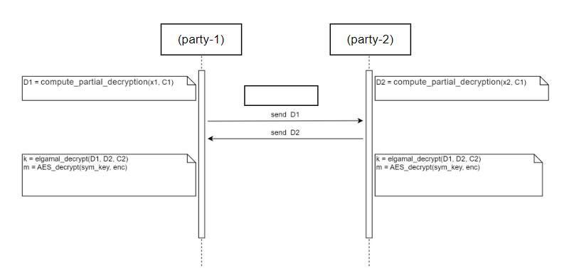

# Threshold Cryptography Demo
This demo is a two party threshold encryption based on the algorithm **ECC-Elliptic-curve cryptography**

## ECC (_Elliptic-curve cryptography_)
**Elliptical curve cryptography (ECC)** is a public key encryption technique based on elliptic curve theory that can be used to create faster, smaller and more efficient cryptographic keys.

**ECC** is an alternative to the **Rivest-Shamir-Adleman ( RSA )** encryption algorithm and is most commonly used for digital signatures in cryptocurrencies such as Bitcoin and Ether, and for one-way encryption of email, data, and software.

**ECC** uses a mathematical process to merge two different keys and then uses the output to encrypt and decrypt the data. One is a public key known to anyone, and the other is a private key known only to the sender and receiver of the data

## ElGamal Encryption Algoritiom
In cryptography, the **ElGamal encryption system** is an **asymmetric key encryption algorithm** for public-key cryptography based on the **Diffie–Hellman key exchange**.

Compared with **RSA** algorithm, the characteristic of **ElGamal** algorithm is that even if the same private key is used to encrypt the same plaintext, the signatures obtained after each encryption are different, which effectively prevents possible replay attacks in the network.

**ElGamal** encryption consists of three components: the **Key Generator**, the **Encryption Algorithm**, and the **Decryption Algorithm**.

### How to convert Elgamal method into ECC?
Reference:\
https://medium.com/asecuritysite-when-bob-met-alice/elgamal-and-elliptic-curve-cryptography-ecc-8b72c3c3555e
https://link.springer.com/chapter/10.1007/3-540-39568-7_2

#### Two-party threshold encryption
Two-party EC-ElGamal scheme: two-party computation of ciphertext

The global decryption key is: $x = x_1 + x_2 \mod p$

The global encryption key is: $h = x * P$

Pros: The key share could be refreshed

#### Notation

| Symbol  | Notion  | Symbol  | Notion  |
| :---: | :---: | :---: | :---: |
| $P$  | The base point of the elliptic curve  | $x$ | Global private key (no one knows it) (type: scalar) |
| $p$  | The order of the base point  | $h$ | Global public key (type: ecpoint) |
| $Z_n$  | The order of the base point  | $x_i$ | party-i 's private key (key share of $x$) (type: scalar) |
| +  | Numerical addition  | $h_i$ | party-i 's public key (key share of $h$) (type: ecpoint) |
| *  | Numerical multiplication  | $c_i$ | party-i 's commiment (type: scalar) |
| $\oplus$  | Elliptic curve point addition operation  | $r_i$ | Random number (type: scalar) |
| $\otimes$  | Elliptic curve multiplier operation  | $m$ | message |
| $H$  | keccak256  | ciphertext | ciphertext of m under AES with symmetric key |
| $k_{point}$ | Point can derive symmetric key | sym_key | symmetric key k |

#### Phase 1 Negotiate the global public key $h$, the encryption key
step1: Generate the keypair $(x_1,h_1)$ of party-1 with respect to $h$ and make the commitment $c_1=H(h_1,r_1)$. Generate party-2's keypair $(x_2,h_2)$ on $h$ and commit $c_2=H(h_2,r_2)$
| Function  | Math operation  |
| :---: | :---: |
|generate_key_share(m, n) at party-i|$x_i \stackrel{R}{\longleftarrow} [m,n], h_i = x_i \otimes P$|
|rand(p) at party-i|r \stackrel{R}{\longleftarrow} [1,p]|
|generate_commitment(m, n) at party-i|c = H(m \|\| n)|
|verify_commitment(c, m, n) at party-i|$c' = H(m \|\| n)$, check $c == c'$|

#### Phase 2 Encrypting
This process is a standard hybrid encryption EC-ElGamal, provided that the encrypting party itself obtains the global encryption key $h$

step1: encrypt-party call generate_sym_key(p) to generate a random $k_{point}$, call compute_sym_key($k_{point}$) to compute the symmetric key symmetric key sym_key

| Function  | Math operation  |
| :---: | :---: |
|generate_key_point(p) at party-i|$k \stackrel{R}{\longleftarrow} [1,p]$, $k_{point} = k\otimes P$|
|compute_sym_key($k_{point}$) at party-i|$sym\_key = H(point2bytes(k_{point})) $|

step2: encrypt-party invokes AES algorithm, encrypts message m with symmetric key sym_key to get symmetric cipher $enc$, and finally encrypts $k_{point}$ with EC-ElGamal to get (C1,C2) by calling elgamal_encrypt( $k_{point}$, h)
| Function  | Math operation  |
| :---: | :---: |
|elgamal_encrypt($k_{point}$) at encrypt-party|$r \stackrel{R}{\longleftarrow} [1,p]$, $C_1 = r \otimes P$, $C_2 = k_{point} \oplus (r \otimes h)$|

step3: Disclose the ciphertext(ciphertext, C1, C2)

#### Phase 3 Two-Party Decryption
step1: Party-i computes a partial decryption of $D_i$ with respect to $C_1$
| Function  | Math operation  |
| :---: | :---: |
|compute_partial_decryption($x_i$, $C_1$) at party-i|$D_i = x_i \otimes C_1$|

step2: party-i sends $D_i$ to party-3-i

step3: party-i calls elgamal_decrypt(D1, D2, C2), get $k_{point}$, calls compute_sym_key($k_{point}$) to compute the symmetric key symmetric key(sym_key)
| Function  | Math operation  |
| :---: | :---: |
|elgamal_decrypt(D1, D2, C2) at party-i|$D = D_1 \oplus D_2$, $k_{point} = C_2 \oplus (-D)$|

step4: party-i calls the AES algorithm and decrypts the symmetric cipher $enc$ with the symmetric key(sym_key) to get the message $m$

## Demo
Implement two-party EC-ElGamal with `Python` and `Dart` respectively
You could find these two demos in the subdirectory `elgamal_python` and `elgamal_dart`
